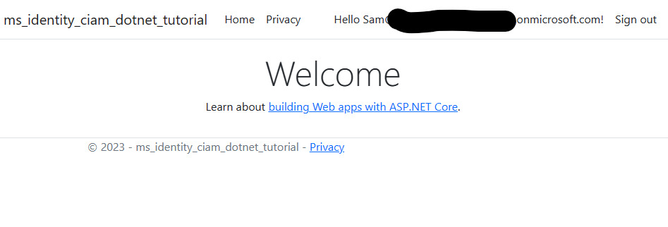

# An ASP.NET Core web app authenticating users against Azure AD CIAM using Microsoft Identity Web

* [Overview](#overview)
* [Scenario](#scenario)
* [Prerequisites](#prerequisites)
* [Setup the sample](#setup-the-sample)
* [Explore the sample](#explore-the-sample)
* [Troubleshooting](#troubleshooting)
* [About the code](#about-the-code)
* [Contributing](#contributing)
* [Learn More](#learn-more)

## Overview

This sample demonstrates an ASP.NET Core web app that authenticates users against Azure AD CIAM with the help of [Microsoft.Identity.Web](https://github.com/AzureAD/microsoft-identity-web)

## Scenario

1. The client ASP.NET Core web app uses the  to sign-in a user and obtain a JWT [ID Token](https://aka.ms/id-tokens) from **Azure AD CIAM**.
1. The **ID Token** proves that the user has successfully authenticated against **Azure AD CIAM**.


## Prerequisites

* Either [Visual Studio](https://visualstudio.microsoft.com/downloads/) or [Visual Studio Code](https://code.visualstudio.com/download) and [.NET Core SDK](https://www.microsoft.com/net/learn/get-started)
* An **Azure AD CIAM** tenant. For more information, see: [How to get an Azure AD CIAM tenant](https://github.com/microsoft/entra-previews/blob/PP2/docs/1-Create-a-CIAM-tenant.md)
* A user account in your **Azure AD CIAM** tenant.

>This sample will not work with a **personal Microsoft account**. If you're signed in to the [Azure portal](https://portal.azure.com) with a personal Microsoft account and have not created a user account in your directory before, you will need to create one before proceeding.

## Setup the sample

### Step 1: Clone or download this repository

From your shell or command line:

```console
git clone https://github.com/Azure-Samples/ms-identity-ciam-dotnet-tutorial.git
```

or download and extract the repository *.zip* file.

> :warning: To avoid path length limitations on Windows, we recommend cloning into a directory near the root of your drive.

### Step 2: Navigate to project folder

```console
cd 1-Authentication\1-sign-in-aspnet-core-mvc
```

### Step 3: Register the sample application(s) in your tenant

There is one project in this sample. To register it, you can:

- follow the steps below for manually register your apps
- or use PowerShell scripts that:
  - **automatically** creates the Azure AD applications and related objects (passwords, permissions, dependencies) for you.
  - modify the projects' configuration files.

<details>
   <summary>Expand this section if you want to use this automation:</summary>

> :warning: If you have never used **Microsoft Graph PowerShell** before, we recommend you go through the [App Creation Scripts Guide](./AppCreationScripts/AppCreationScripts.md) once to ensure that your environment is prepared correctly for this step.

1. Ensure that you have [PowerShell 7](https://learn.microsoft.com/powershell/scripting/install/installing-powershell-on-windows?view=powershell-7.3) or later.
1. Run the script to create your Azure AD application and configure the code of the sample application accordingly.
1. For interactive process -in PowerShell, run:

    ```PowerShell
    cd .\AppCreationScripts\
    .\Configure.ps1 -TenantId "[Optional] - your tenant id" -AzureEnvironmentName "[Optional] - Azure environment, defaults to 'Global'"
    ```

> Other ways of running the scripts are described in [App Creation Scripts guide](./AppCreationScripts/AppCreationScripts.md). The scripts also provide a guide to automated application registration, configuration and removal which can help in your CI/CD scenarios.

</details>

#### Choose the Azure AD CIAM tenant where you want to create your applications

To manually register the apps, as a first step you'll need to:

1. Sign in to the [Azure portal](https://portal.azure.com).
1. If your account is present in more than one Azure AD CIAM tenant, select your profile at the top right corner in the menu on top of the page, and then **switch directory** to change your portal session to the desired Azure AD CIAM tenant.

#### Create User Flows

Please refer to: [Tutorial: Create user flow in Azure Active Directory CIAM](https://github.com/microsoft/entra-previews/blob/PP2/docs/3-Create-sign-up-and-sign-in-user-flow.md)

> :information_source: To enable password reset in Customer Identity Access Management (CIAM) in Azure Active Directory (Azure AD), please refer to: [Tutorial: Enable self-service password reset](https://github.com/microsoft/entra-previews/blob/PP2/docs/4-Enable-password-reset.md)

#### Add External Identity Providers

Please refer to:

* [Tutorial: Add Google as an identity provider](https://github.com/microsoft/entra-previews/blob/PP2/docs/6-Add-Google-identity-provider.md)
* [Tutorial: Add Facebook as an identity provider](https://github.com/microsoft/entra-previews/blob/PP2/docs/7-Add-Facebook-identity-provider.md)

#### Register the client app (ciam-aspnet-webapp)

1. Navigate to the [Azure portal](https://portal.azure.com) and select the **Azure AD CIAM** service.
1. Select the **App Registrations** blade on the left, then select **New registration**.
1. In the **Register an application page** that appears, enter your application's registration information:
    1. In the **Name** section, enter a meaningful application name that will be displayed to users of the app, for example `ciam-aspnet-webapp`.
    1. Under **Supported account types**, select **Accounts in this organizational directory only**
    1. Select **Register** to create the application.
1. In the **Overview** blade, find and note the **Application (client) ID**. You use this value in your app's configuration file(s) later in your code.
1. In the app's registration screen, select the **Authentication** blade to the left.
1. If you don't have a platform added, select **Add a platform** and select the **Web** option.
    1. In the **Redirect URI** section enter the following redirect URIs:
        1. `https://localhost:7274/`
        1. `https://localhost:7274/signin-oidc`
    1. In the **Front-channel logout URL** section, set it to `https://localhost:7274/signout-callback-oidc`.
    1. In the **Implicit grant** section, check the **ID tokens** option as this sample requires the [Implicit grant flow](https://docs.microsoft.com/azure/active-directory/develop/v2-oauth2-implicit-grant-flow) to be enabled to sign-in the user and call an API.
    1. Select **ID tokens (used for implicit and hybrid flows)** checkbox.
    1. Click **Save** to save your changes.
1. Since this app signs-in users, we will now proceed to select **delegated permissions**, which is is required by apps signing-in users.
    1. In the app's registration screen, select the **API permissions** blade in the left to open the page where we add access to the APIs that your application needs:
    1. Select the **Add a permission** button and then:
    1. Ensure that the **Microsoft APIs** tab is selected.
    1. In the *Commonly used Microsoft APIs* section, select **Microsoft Graph**
    1. In the **Delegated permissions** section, select **openid**, **offline_access** in the list. Use the search box if necessary.
    1. Select the **Add permissions** button at the bottom.
1. At this stage, the permissions are assigned correctly, but since it's a CIAM tenant, the users themselves cannot consent to these permissions. To get around this problem, we'd let the [tenant administrator consent on behalf of all users in the tenant](https://docs.microsoft.com/azure/active-directory/develop/v2-admin-consent). Select the **Grant admin consent for {tenant}** button, and then select **Yes** when you are asked if you want to grant consent for the requested permissions for all accounts in the tenant. You need to be a tenant admin to be able to carry out this operation.

##### Configure the client app (ciam-aspnet-webapp) to use your app registration

Open the project in your IDE (like Visual Studio or Visual Studio Code) to configure the code.

> In the steps below, "ClientID" is the same as "Application ID" or "AppId".

1. Open the `appsettings.json` file.
1. Find the key `Enter_the_Application_Id_Here` and replace the existing value with the application ID (clientId) of `ciam-aspnet-webapp` app copied from the Azure portal.
1. Find the key `Enter_the_Tenant_Id_Here` and replace the existing value with your Azure AD tenant/directory ID.

### Step 4: Running the sample

From your shell or command line, execute the following commands:

```console
    cd 1-Authentication\1-sign-in-aspnet-core-mvc
    dotnet run
```

## Explore the sample

1. Open your web browser and navigate to <https://localhost:7274>.
1. Sign-in with an account registered to the CIAM tenant.
1. You should now see your display name next to a **Sign out** button.
1. When you're done exploring you can end the session and sign out with the **Sign out** button



> :information_source: Did the sample not work for you as expected? Then please reach out to us using the [GitHub Issues](../../../../issues) page.

## We'd love your feedback!

Were we successful in addressing your learning objective? Consider taking a moment to [share your experience with us](https://forms.microsoft.com/Pages/DesignPageV2.aspx?subpage=design&m2=1&id=v4j5cvGGr0GRqy180BHbR9p5WmglDttMunCjrD00y3NUMlJETFFSQVQ4SjBGQk9aVUhPS0JUOUJUUi4u).

## Troubleshooting

<details>
	<summary>Expand for troubleshooting info</summary>

ASP.NET core applications create session cookies that represent the identity of the caller. Some Safari users using iOS 12 had issues which are described in ASP.NET Core #4467 and the Web kit bugs database Bug 188165 - iOS 12 Safari breaks ASP.NET Core 2.1 OIDC authentication.

If your web site needs to be accessed from users using iOS 12, you probably want to disable the SameSite protection, but also ensure that state changes are protected with CSRF anti-forgery mechanism. See the how to fix section of Microsoft Security Advisory: iOS12 breaks social, WSFed and OIDC logins #4647

To provide feedback on or suggest features for Azure Active Directory, visit [User Voice page](https://feedback.azure.com/d365community/forum/79b1327d-d925-ec11-b6e6-000d3a4f06a4).
</details>

## About the code

This sample shows how to use the OpenID Connect ASP.NET Core middleware to sign in users from a single Azure AD CIAM tenant. The middleware is initialized in the `Program.cs` file by passing it the Client ID of the app, and the URL of the Azure AD tenant where the app is registered. These values are  read from the `appsettings.json` file. The middleware takes care of:

- Downloading the Azure AD metadata, finding the signing keys, and finding the issuer name for the tenant.
- Processing OpenID Connect sign-in responses by validating the signature and issuer in an incoming JWT, extracting the user's claims, and putting the claims in `ClaimsPrincipal.Current`.
- Integrating with the session cookie ASP.NET Core middleware to establish a session for the user.

You can trigger the middleware to send an OpenID Connect sign-in request by decorating a class or method with the `[Authorize]` attribute or by issuing a challenge (see the [AccountController.cs](https://github.com/aspnet/AspNetCore/blob/master/src/Azure/AzureAD/Authentication.AzureAD.UI/src/Areas/AzureAD/Controllers/AccountController.cs) file which is part of ASP.NET Core):

The middleware in this project is created as a part of the open-source [ASP.NET Core Security](https://github.com/aspnet/aspnetcore) project.

These steps are encapsulated in the [Microsoft.Identity.Web](https://github.com/AzureAD/microsoft-identity-web/wiki) library.

### Deploying Web app to Azure App Service

There is one web app in this sample. To deploy it to **Azure App Services**, you'll need to:

- create an **Azure App Service**
- publish the projects to the **App Services**, and
- update its client(s) to call the website instead of the local environment.

#### Publish your files (ciam-aspnet-webapp)

##### Publish using Visual Studio

Follow the link to [Publish with Visual Studio](https://docs.microsoft.com/visualstudio/deployment/quickstart-deploy-to-azure).

##### Publish using Visual Studio Code

1. Install the Visual Studio Code extension [Azure App Service](https://marketplace.visualstudio.com/items?itemName=ms-azuretools.vscode-azureappservice).
1. Follow the link to [Publish with Visual Studio Code](https://docs.microsoft.com/aspnet/core/tutorials/publish-to-azure-webapp-using-vscode)

#### Update the CIAM app registration (ciam-aspnet-webapp)

1. Navigate back to to the [Azure portal](https://portal.azure.com).
In the left-hand navigation pane, select the **Azure Active Directory** service, and then select **App registrations (Preview)**.
1. In the resulting screen, select the `ciam-aspnet-webapp` application.
1. In the app's registration screen, select **Authentication** in the menu.
    1. In the **Redirect URIs** section, update the reply URLs to match the site URL of your Azure deployment. For example:
        1. `https://ciam-aspnet-webapp.azurewebsites.net/`
        1. `https://ciam-aspnet-webapp.azurewebsites.net/signin-oidc`
    1. Update the **Front-channel logout URL** fields with the address of your service, for example [https://ciam-aspnet-webapp.azurewebsites.net](https://ciam-aspnet-webapp.azurewebsites.net)

> :warning: If your app is using an *in-memory* storage, **Azure App Services** will spin down your web site if it is inactive, and any records that your app was keeping will be empty. In addition, if you increase the instance count of your website, requests will be distributed among the instances. Your app's records, therefore, will not be the same on each instance.
</details>

## Contributing

If you'd like to contribute to this sample, see [CONTRIBUTING.MD](/CONTRIBUTING.md).

This project has adopted the [Microsoft Open Source Code of Conduct](https://opensource.microsoft.com/codeofconduct/). For more information, see the [Code of Conduct FAQ](https://opensource.microsoft.com/codeofconduct/faq/) or contact [opencode@microsoft.com](mailto:opencode@microsoft.com) with any additional questions or comments.

## Learn More

* [Customize the default branding](https://github.com/microsoft/entra-previews/blob/PP2/docs/5-Customize-default-branding.md)
* [OAuth 2.0 device authorization grant flow](https://github.com/microsoft/entra-previews/blob/PP2/docs/9-OAuth2-device-code.md)
* [Customize sign-in strings](https://github.com/microsoft/entra-previews/blob/PP2/docs/8-Customize-sign-in-strings.md)
* [Building Zero Trust ready apps](https://aka.ms/ztdevsession)
* [Microsoft.Identity.Web](https://aka.ms/microsoft-identity-web)
