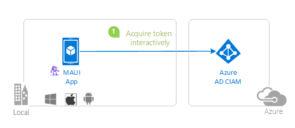
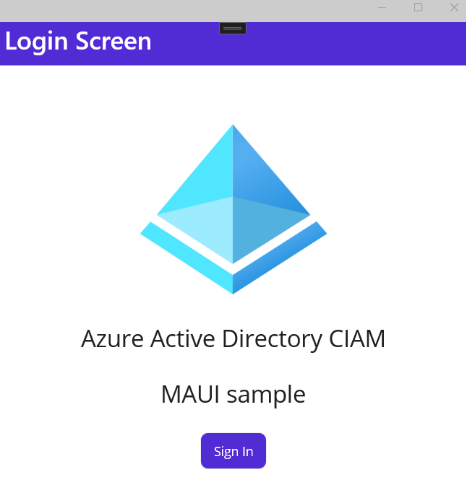

# A .NET MAUI app using MSAL.NET to sign-in users and calling MS Graph Api

[](https://identitydivision.visualstudio.com/IDDP/_build/latest?definitionId=XXX)

* [Overview](#overview)
* [Scenario](#scenario)
* [Prerequisites](#prerequisites)
* [Setup the sample](#setup-the-sample)
* [Explore the sample](#explore-the-sample)
* [About the code](#about-the-code)
* [Troubleshooting](#troubleshooting)
* [Contributing](#contributing)
* [Learn More](#learn-more)

## Overview

This sample demonstrates a MAUI (iOS, Android, WinUI) calling Microsoft Graph.

> :information_source: To learn how applications integrate with [Microsoft Graph](https://aka.ms/graph), consider going through the recorded session:: [An introduction to Microsoft Graph for developers](https://www.youtube.com/watch?v=EBbnpFdB92A)

## Scenario

1. The client MAUI (iOS, Android, WinUI) uses the [MSAL.NET](https://aka.ms/msal-net) to sign-in a user and obtain a JWT [ID Token](https://aka.ms/id-tokens) and an [Access Token](https://aka.ms/access-tokens) from **Azure AD CIAM**.
1. The **access token** is used as a *bearer* token to authorize the user to call the Microsoft Graph protected by **Azure AD CIAM**.



## Prerequisites

* [Visual Studios](https://aka.ms/vsdownload) with the **MAUI** workload installed:
  - [Instructions for Windows](https://learn.microsoft.com/dotnet/maui/get-started/installation?tabs=vswin)
  - [Instructions for MacOS](https://learn.microsoft.com/dotnet/maui/get-started/installation?tabs=vsma)
* An **Azure AD CIAM** tenant. For more information, see: [How to get an Azure AD CIAM tenant](https://github.com/microsoft/entra-previews/blob/PP2/docs/1-Create-a-CIAM-tenant.md)
* A user account in your **Azure AD CIAM** tenant.

>This sample will not work with a **personal Microsoft account**. If you're signed in to the [Azure portal](https://portal.azure.com) with a personal Microsoft account and have not created a user account in your directory before, you will need to create one before proceeding.

## Setup the sample

### Step 1: Clone or download this repository

From your shell or command line:

```console
git clone https://github.com/Azure-Samples/active-directory-xamarin-native-v2.git
```

or download and extract the repository *.zip* file.

> :warning: To avoid path length limitations on Windows, we recommend cloning into a directory near the root of your drive.

### Step 2: Navigate to project folder
You don't have to change current folder. 

### Step 3: Register the sample application(s) in your tenant

> :information_source: While there are multiple projects in this sample, we'd register just one app with Azure AD and use the registered app's *client id* in both apps. This reuse of app ids (client ids) is used when the apps themselves are just components of one larger app topology.  

There is one project in this sample. To register it, you can:

- follow the steps below for manually register your apps
- or use PowerShell scripts that:
  - **automatically** creates the Azure AD applications and related objects (passwords, permissions, dependencies) for you.
  - modify the projects' configuration files.

<details>
   <summary>Expand this section if you want to use this automation:</summary>

> :warning: If you have never used **Microsoft Graph PowerShell** before, we recommend you go through the [App Creation Scripts Guide](./AppCreationScripts/AppCreationScripts.md) once to ensure that your environment is prepared correctly for this step.

1. Run the script to create your Azure AD application and configure the code of the sample application accordingly.
1. For interactive process -in PowerShell, run:

    ```PowerShell
    cd .\AppCreationScripts\
    .\Configure.ps1 -TenantId "[Optional] - your tenant id" -AzureEnvironmentName "[Optional] - Azure environment, defaults to 'Global'"
    ```

> Other ways of running the scripts are described in [App Creation Scripts guide](./AppCreationScripts/AppCreationScripts.md). The scripts also provide a guide to automated application registration, configuration and removal which can help in your CI/CD scenarios.
    

</details>

#### Choose the Azure AD CIAM tenant where you want to create your applications

To manually register the apps, as a first step you'll need to:

1. Sign in to the [Azure portal](https://portal.azure.com).
1. If your account is present in more than one Azure AD CIAM tenant, select your profile at the top right corner in the menu on top of the page, and then **switch directory** to change your portal session to the desired Azure AD CIAM tenant.

#### Create User Flows

Please refer to: [Tutorial: Create user flow in Azure Active Directory CIAM](https://github.com/microsoft/entra-previews/blob/PP2/docs/3-Create-sign-up-and-sign-in-user-flow.md)

> :information_source: To enable password reset in Customer Identity Access Management (CIAM) in Azure Active Directory (Azure AD), please refer to: [Tutorial: Enable self-service password reset](https://github.com/microsoft/entra-previews/blob/PP2/docs/4-Enable-password-reset.md)

#### Add External Identity Providers

Please refer to:

* [Tutorial: Add Google as an identity provider](https://github.com/microsoft/entra-previews/blob/PP2/docs/6-Add-Google-identity-provider.md)
* [Tutorial: Add Facebook as an identity provider](https://github.com/microsoft/entra-previews/blob/PP2/docs/7-Add-Facebook-identity-provider.md)

#### Register the client app (active-directory-maui-v2)

1. Navigate to the [Azure portal](https://portal.azure.com) and select the **Azure AD CIAM** service.
1. Select the **App Registrations** blade on the left, then select **New registration**.
1. In the **Register an application page** that appears, enter your application's registration information:
    1. In the **Name** section, enter a meaningful application name that will be displayed to users of the app, for example `active-directory-maui-v2`.
    1. Under **Supported account types**, select **Accounts in this organizational directory only**
    1. Select **Register** to create the application.
1. In the **Overview** blade, find and note the **Application (client) ID**. You use this value in your app's configuration file(s) later in your code.
1. In the app's registration screen, select the **Authentication** blade to the left.
1. If you don't have a platform added, select **Add a platform** and select the **Public client (mobile & desktop)** option.
    1. In the **Redirect URIs** section, add **msal{ClientId}://auth**.
        The **ClientId** is the Id of the App Registration and can be found under **Overview/Application (client) ID**
    1. Click **Save** to save your changes.

##### Configure the client app (active-directory-maui-v2) to use your app registration

Open the project in your IDE (like Visual Studio or Visual Studio Code) to configure the code.

> In the steps below, "ClientID" is the same as "Application ID" or "AppId".

1. Open the `appsettings.json` file.
1. Find the key `Instance` and replace the existing value with the instance url of your CIAM tenant (in most cases you'll need to replace the value of `Your_Tenant_Name_Here` with the name of your tenant).
1. Find the key `TenantId` and replace the existing value with your Azure AD tenant/directory ID.
1. Find the key `ClientId` and replace the existing value with the application ID (clientId) of `active-directory-maui-v2` app copied from the Azure portal.
1. Find the key `CacheFileName` and replace the existing value with the name of the cache file you wish to use with WinUI caching (not used in Android nor iOS).
1. Find the key `CacheDir` and replace the existing value with the directory path storing cache file you wish to use with WinUI caching (not used in Android nor iOS).
1. Find the key `Scopes` and replace the existing value with the scopes (space separated) you wish to use in your application.

1. Open the `Platforms\Android\MsalActivity.cs` file.
1. Find the key `[REPLACE THIS WITH THE CLIENT ID OF YOUR APP]` and replace the existing value with the application ID (clientId) of `active-directory-maui-v2` app copied from the Azure portal.

1. Open the `Platforms\Android\AndroidManifest.xml` file.
1. Find the key `[REPLACE THIS WITH THE CLIENT ID OF YOUR APP]` and replace the existing value with the application ID (clientId) of `active-directory-maui-v2` app copied from the Azure portal.

1. Open the `Platforms\iOS\AppDelegate.cs` file.
1. Find the key `[REPLACE THIS WITH THE CLIENT ID OF YOUR APP]` and replace the existing value with the application ID (clientId) of `active-directory-maui-v2` app copied from the Azure portal.

### Step 4: Running the sample

Choose the platform you want to work on by setting the startup project in the Solution Explorer. Make sure that your platform of choice is marked for build and deploy in the Configuration Manager.
Clean the solution, rebuild the solution, and run it:


## Explore the sample


Click the sign-in button at the bottom of the application screen.



On the sign-in screen, you can sign-in with a microsoft account directly on the screen or through another flow like Facebook or Google if you have that set up on your tenant.

As examples:

[Add Google as an identity provider](https://github.com/microsoft/entra-previews/blob/PP2/docs/6-Add-Google-identity-provider.md)
[Add Facebook as an identity provider](https://github.com/microsoft/entra-previews/blob/PP2/docs/7-Add-Facebook-identity-provider.md)

The sample works exactly in the same way regardless of the account type you choose, apart from some visual differences in the authentication and consent experience. During the sign in process, you will be prompted to grant various permissions (to allow the application to access your data).


Upon successful sign in and consent, the application screen will display the main page.

After you sign-in you will see a screen displaying the scopes available on the access token acquired after signing in.


On WinUI sessions are cached. You can close the application and reopen it. You will see that the app retains access to the API and retrieves the user info right away, without the need to sign in again.

Sign out by clicking the sign out button.


> :information_source: Did the sample not work for you as expected? Then please reach out to us using the [GitHub Issues](../../../../issues) page.

## We'd love your feedback!

Were we successful in addressing your learning objective? Consider taking a moment to [share your experience with us](Enter_Survey_Form_Link).

Could not find a part of the path 'C:\GitHub\AzureSamples\ms-identity-ciam-dotnet-tutorial\1-Authentication\2-sign-in-maui\ReadmeFiles\TroubleShooting.md'.

Could not find a part of the path 'C:\GitHub\AzureSamples\ms-identity-ciam-dotnet-tutorial\1-Authentication\2-sign-in-maui\ReadmeFiles\AboutTheCode.md'.
</details>

Could not find a part of the path 'C:\GitHub\AzureSamples\ms-identity-ciam-dotnet-tutorial\1-Authentication\2-sign-in-maui\ReadmeFiles\NextSteps.md'.

## About the code

The structure of the solution is straightforward. Authentication logic resides in the `MSALClient` folder and UX logic within the `Views` folder.

- MSAL's main primitive for native clients, `PublicClientApplication`, is initialized as a static variable in `MSALClientHelper.cs` (For details see [Client applications in MSAL.NET](https://github.com/AzureAD/microsoft-authentication-library-for-dotnet/wiki/Client-Applications))

- When the app tries to get an access token to make an API call after the sign in button is clicked (`MainView.xaml.cs`) it will attempt to get a token without showing any UX - just in case a suitable token is already present in the cache from previous sessions. This is the code performing that logic:

```CSharp
private async void OnSignInClicked(object sender, EventArgs e)
{
    await PublicClientSingleton.Instance.AcquireTokenSilentAsync();
    await Shell.Current.GoToAsync("scopeview");
}
```

- If the attempt to obtain a token silently fails, a screen with the sign in button (at the bottom of the application) is displayed.
- When the sign in button is pressed, we execute the same logic - but using a method that shows interactive UX:

```CSharp
return await this.PublicClientApplication.AcquireTokenInteractive(scopes)
    .WithParentActivityOrWindow(PlatformConfig.Instance.ParentWindow)
    .ExecuteAsync()
    .ConfigureAwait(false);
```

- The `Scopes` parameter indicates the permissions the application needs to gain access to the data requested through subsequent web API call.

- The sign out logic is very simple. In this sample we have just one user, however we are demonstrating a more generic sign out logic that you can apply if you have multiple concurrent users and you want to clear up the entire cache.

```CSharp
await this.PublicClientApplication.RemoveAsync(user).ConfigureAwait(false);
```

### iOS specific considerations

The `Platforms\iOS` project only requires one extra line, in `AppDelegate.cs`.
You need to ensure that the `OpenUrl` handler looks as the snippet below:

```CSharp
public override bool OpenUrl(UIApplication application, NSUrl url, NSDictionary options)
{
    if (AuthenticationContinuationHelper.IsBrokerResponse(null))
    {
        // Done on different thread to allow return in no time.
        _ = Task.Factory.StartNew(() => AuthenticationContinuationHelper.SetBrokerContinuationEventArgs(url));

        return true;
    }

    else if (!AuthenticationContinuationHelper.SetAuthenticationContinuationEventArgs(url))
    {
        return false;
    }

    return true;
}
```

This logic is meant to ensure that once the interactive portion of the authentication flow is concluded by the Authenticator app, the flow goes back to MSAL.

Also, in order to make the token cache work and have the `AcquireTokenSilentAsync` work multiple steps must be followed :

1. Enable Keychain access in your `Entitlements.plist` file and specify in the **Keychain Groups** your bundle identifier.
1. In your project options, on iOS **Bundle Signing view**, select your `Entitlements.plist` file for the Custom Entitlements field.
1. When signing a certificate, make sure XCode uses the same Apple Id.

## Troubleshooting

### Some projects don't load in Visual Studio

This might be because you have not installed all the required components from Visual Studio. You need to add the **.NET Mutli-platform App UI development** [workload](https://learn.microsoft.com/en-us/visualstudio/install/modify-visual-studio?view=vs-2022), in the Visual Studio Installer.

### The project you want is not built

you need to right click on the visual studio solution, choose **Configuration Properties** > **Configuration** and make sure that you check the projects and configuration you want to build (and deploy)

## Contributing

If you'd like to contribute to this sample, see [CONTRIBUTING.MD](/CONTRIBUTING.md).

This project has adopted the [Microsoft Open Source Code of Conduct](https://opensource.microsoft.com/codeofconduct/). For more information, see the [Code of Conduct FAQ](https://opensource.microsoft.com/codeofconduct/faq/) or contact [opencode@microsoft.com](mailto:opencode@microsoft.com) with any additional questions or comments.

## Learn More

* [Customize the default branding](https://github.com/microsoft/entra-previews/blob/PP2/docs/5-Customize-default-branding.md)
* [OAuth 2.0 device authorization grant flow](https://github.com/microsoft/entra-previews/blob/PP2/docs/9-OAuth2-device-code.md)
* [Customize sign-in strings](https://github.com/microsoft/entra-previews/blob/PP2/docs/8-Customize-sign-in-strings.md)
* [Building Zero Trust ready apps](https://aka.ms/ztdevsession)
[Public client and confidential client applications](https://learn.microsoft.com/en-us/azure/active-directory/develop/msal-client-applications)
[Token cache serialization in MSAL\.NET](https://learn.microsoft.com/en-us/azure/active-directory/develop/msal-net-token-cache-serialization)

