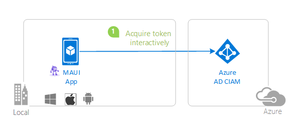

# A .NET MAUI Blazor Hybrid app using MSAL.NET to authenticate users against Microsoft Entra External ID

* [Overview](#overview)
* [Scenario](#scenario)
* [Prerequisites](#prerequisites)
* [Setup the sample](#setup-the-sample)
* [Explore the sample](#explore-the-sample)
* [About the code](#about-the-code)
* [Troubleshooting](#troubleshooting)
* [Contributing](#contributing)
* [Learn More](#learn-more)

## Overview

This sample demonstrates a **4-project Blazor solution** that authenticates users with Microsoft Entra External ID (CIAM) and runs the **same shared UI** natively (MAUI) and on the web across **every Blazor render mode**:

| Project | Description |
|---|---|
| **SignInBlazorMaui** | .NET MAUI Blazor Hybrid app (iOS, Android, Mac Catalyst, Windows) using MSAL.NET for native sign-in |
| **SignInBlazorMaui.Shared** | Razor Class Library with the shared Blazor components (pages, layouts, services) used by both MAUI and Web |
| **SignInBlazorMaui.Web** | ASP.NET Core Blazor Web App (server) using Microsoft.Identity.Web for OIDC sign-in. Hosts the shared UI in static SSR, Interactive Server, and Interactive WebAssembly, and exposes protected `/api/weather` and `/api/profile` endpoints |
| **SignInBlazorMaui.Web.Client** | Blazor WebAssembly client for the Web App's Interactive WebAssembly / Interactive Auto pages. It stores **no tokens** — it receives the authentication state serialized from the server |

The same Blazor UI runs natively on mobile/desktop (via MAUI) and in the browser (via the Blazor Web App), with platform-appropriate authentication on each. This sample targets **.NET 10**.

## Scenario

1. The **MAUI app** uses MSAL.NET to sign in a user interactively, obtain a JWT [ID Token](https://aka.ms/id-tokens) from **Microsoft Entra External ID**, and call the Web APIs with the access token.
1. The **Web app** uses OpenID Connect (via Microsoft.Identity.Web) to sign in browser users, hosts the shared UI across all Blazor render modes, and exposes protected `/api/weather` and `/api/profile` endpoints.
1. Both apps share the same Blazor components. The **Profile** page shows how a mutable per-user value is read and written differently per render mode: directly in-process (Interactive Server on the web) or through the API (WebAssembly and MAUI).



## Prerequisites

* [Visual Studio 2022 17.14+](https://aka.ms/vsdownload) or the [.NET 10 SDK](https://dotnet.microsoft.com/download/dotnet/10.0) with the **MAUI** and **wasm-tools** workloads installed:
  * [Instructions for Windows](https://learn.microsoft.com/dotnet/maui/get-started/installation?tabs=vswin)
  * [Instructions for MacOS](https://learn.microsoft.com/dotnet/maui/get-started/installation?tabs=vsma)
* An external tenant. To create one, choose from the following methods:
    * (Recommended) Use the [Microsoft Entra External ID extension](https://aka.ms/ciamvscode/readme/marketplace) to set up an external tenant directly in Visual Studio Code.
    * [Create a new external tenant](https://learn.microsoft.com/entra/external-id/customers/how-to-create-external-tenant-portal) in the Microsoft Entra admin center.
* A user account in your **Microsoft Entra External ID** tenant.

> This sample will not work with a **personal Microsoft account**. If you're signed in to the [Azure portal](https://portal.azure.com) with a personal Microsoft account and have not created a user account in your directory before, you will need to create one before proceeding.

## Setup the sample

### Step 1: Clone or download this repository

From your shell or command line:

```console
git clone https://github.com/Azure-Samples/ms-identity-ciam-dotnet-tutorial.git
```

or download and extract the repository *.zip* file.

> :warning: To avoid path length limitations on Windows, we recommend cloning into a directory near the root of your drive.

### Step 2: Navigate to project folder

```console
cd 1-Authentication\3-sign-in-blazor-maui
```

### Step 3: Register the sample application(s) in your tenant

This sample requires **two** app registrations — a public client for the MAUI app and a confidential client for the Web app. The Blazor WebAssembly client (`SignInBlazorMaui.Web.Client`) needs **no** registration of its own: authentication happens on the server and the authentication state is serialized to the browser. You can:

- follow the steps below to manually register your apps
- or use the PowerShell scripts that **automatically** create both registrations, set permissions, create a user flow, and patch all configuration files

<details>
   <summary>Expand this section if you want to use the automated scripts:</summary>

> :warning: If you have never used **Microsoft Graph PowerShell** before, we recommend you go through the [App Creation Scripts Guide](./AppCreationScripts/AppCreationScripts.md) once to ensure that your environment is prepared correctly for this step.

1. Ensure that you have [PowerShell 7](https://learn.microsoft.com/powershell/scripting/install/installing-powershell-on-windows?view=powershell-7.3) or later.
1. Run the script to create your Azure AD applications and configure the code:

    ```PowerShell
    cd .\AppCreationScripts\
    .\Configure.ps1 -TenantId "[Optional] - your tenant id"
    ```

   The script will:
   - Create a **Web app** registration (`ciam-dotnet-blazor-maui-web`) with OIDC redirect URI, API scope (`access_as_user`), and client secret
   - Create a **MAUI app** registration (`ciam-dotnet-blazor-maui`) with MSAL redirect URIs and permission to the Web API
   - Create a sign-up/sign-in user flow and link both apps
   - Patch `SignInBlazorMaui/appsettings.json`, `SignInBlazorMaui.Web/appsettings.json`, `AndroidManifest.xml`, and `Info.plist`

> Other ways of running the scripts are described in [App Creation Scripts guide](./AppCreationScripts/AppCreationScripts.md).

</details>

#### Manual registration

##### Register the Web app (ciam-dotnet-blazor-maui-web)

1. Navigate to the [Azure portal](https://portal.azure.com) and select **Microsoft Entra External ID**.
1. Select **App Registrations** > **New registration**.
1. Enter name: `ciam-dotnet-blazor-maui-web`, select **Accounts in this organizational directory only**.
1. Under **Authentication** > **Web** platform, add redirect URI: `https://localhost:7157/signin-oidc`
1. Enable **ID tokens** under Implicit grant.
1. Under **Certificates & secrets**, create a new client secret and note the value.
1. Under **Expose an API**, set Application ID URI to `api://{clientId}` and add a scope `access_as_user`.
1. Under **API permissions**, add `openid` and `offline_access` from Microsoft Graph.
1. Update `SignInBlazorMaui.Web/appsettings.json` with the Instance, TenantId, ClientId, and ClientSecret.

##### Register the MAUI app (ciam-dotnet-blazor-maui)

1. Create another app registration: `ciam-dotnet-blazor-maui`, select **Accounts in this organizational directory only**.
1. Enable **Allow public client flows** (under Authentication > Advanced settings).
1. Add redirect URIs under **Mobile and desktop applications**: `msal{ClientId}://auth` and `http://localhost`
1. Under **API permissions**, add `openid`, `offline_access` from Microsoft Graph and `access_as_user` from the Web app.
1. Update `SignInBlazorMaui/appsettings.json` with Authority and ClientId.
1. Update `Platforms/Android/AndroidManifest.xml` and `Platforms/iOS/Info.plist` with the MSAL redirect scheme.

##### Create a user flow

1. In the Entra admin center, go to **External Identities** > **User flows**.
1. Create a sign-up/sign-in flow and link both app registrations to it.

### Step 4: Running the sample

#### Run the Web app

```console
cd SignInBlazorMaui.Web
dotnet run
```

Open `https://localhost:7157` in your browser.

#### Run the MAUI app

Choose the platform you want to work on by setting the startup project in the Solution Explorer. Make sure that your platform of choice is marked for build and deploy in the Configuration Manager.

Clean the solution, rebuild the solution, and run it.

## Explore the sample

### Web app

Open `https://localhost:7157`. You'll be redirected to sign in with Microsoft Entra External ID via OIDC. After signing in you'll see the home page (static SSR). Navigate between **Counter** (Interactive Auto), **Weather** (WebAssembly), **Account** (WebAssembly, read-only claims), and **Profile** (Interactive Server). Each page shows a badge indicating the render mode it is currently running in. Edit and save your **Profile** value and note that it persists across render modes and in the MAUI app.

### MAUI app

Click the **Sign in with Microsoft** button. On iOS/Mac Catalyst, a system browser sheet opens; on Android, a Chrome Custom Tab; on Windows, an embedded WebView2 dialog. After signing in, you can view your claims, weather data, and edit your profile. Every page runs interactively in the native WebView regardless of the render mode it declares.

## About the code

### Solution structure

The solution uses a **shared Razor Class Library** pattern:

- **SignInBlazorMaui.Shared** contains all shared Blazor components (Home, Counter, Weather, Account, and Profile pages), layout (MainLayout, NavMenu), the `RenderModeIndicator` component, and the service interfaces (`IFormFactor`, `IWeatherService`, `IUserProfileService`).

- **SignInBlazorMaui** (MAUI) provides native implementations: `MsalAuthenticationStateProvider` for MSAL-based auth, `FormFactor` using `DeviceInfo`, HTTP-based `WeatherService` and `UserProfileService` that attach the MSAL access token, and platform-specific code for each target (Android `MsalActivity`, iOS `OpenUrl` handler, Mac Catalyst `ASWebAuthenticationSession` workaround, Windows WinUI3).

- **SignInBlazorMaui.Web** provides the server implementations and the API: Microsoft.Identity.Web for OIDC auth, `FormFactor` returning "Web", `WeatherService` generating mock data, `ServerUserProfileService` backed by an in-process `ProfileStore`, and the protected `/api/weather` and `/api/profile` endpoints.

- **SignInBlazorMaui.Web.Client** (Blazor WebAssembly) provides the browser implementations used by the WebAssembly and Auto pages: `FormFactor` returning "WebAssembly", and `ClientWeatherService` / `ClientUserProfileService` that call the APIs same-origin with the authentication cookie.

### Blazor render modes

The Web App uses **per-page interactivity**, so each page selects the render mode that best fits it. The shared `RenderModeIndicator` component displays the mode a page is currently running in.

| Page | Route | Render mode | Notes |
|---|---|---|---|
| Home | `/` | **Static SSR** | Content only — no interactivity and no persistent server connection |
| Counter | `/counter` | **Interactive Auto** | Renders on the server for the first visit, then on WebAssembly once the runtime has downloaded |
| Weather | `/weather` | **Interactive WebAssembly** | Runs in the browser and calls the protected `/api/weather` endpoint — no server SignalR circuit |
| Account | `/account` | **Interactive WebAssembly** | Read-only claims, rendered locally on the client from the serialized authentication state |
| Profile | `/profile` | **Interactive Server** | Edits a per-user value with direct, in-process access to the server-side store — no API call needed |

This layout shows the real-world trade-off between render modes: pages that only need to read or edit data are served as static SSR or WebAssembly to avoid a per-user Interactive Server circuit, while a page that benefits from direct in-process server access (`Profile`) uses Interactive Server.

Because the shared pages declare a per-page `@rendermode` and are also hosted by the MAUI `BlazorWebView`, they use an indirection (`InteractiveRenderSettings` in the `.Shared` RCL) to assign render modes. On .NET 10 a `BlazorWebView` is always interactive and throws if a component specifies a render mode, so the MAUI app calls `InteractiveRenderSettings.ConfigureBlazorHybridRenderModes()` at startup to clear the modes (they become no-ops) while the web app keeps the real per-page modes. See the comments in `SignInBlazorMaui.Shared/InteractiveRenderSettings.cs` for details. On .NET 11 this workaround is no longer needed ([dotnet/aspnetcore#65876](https://github.com/dotnet/aspnetcore/pull/65876) makes Blazor Hybrid treat render modes as no-ops natively).

### MAUI authentication

MSAL configuration is loaded from an embedded `appsettings.json` via `MsalConfig.cs`. The `MsalServiceExtensions.AddMsalClient()` method builds the `IPublicClientApplication` with platform-specific options:

- **iOS**: System web view via `WithSystemWebViewOptions`
- **Android**: Parent activity via `WithParentActivityOrWindow`
- **Mac Catalyst**: `ASWebAuthenticationSession` via custom `ICustomWebUi` (workaround for missing maccatalyst TFM in MSAL — [tracking issue](https://github.com/AzureAD/microsoft-authentication-library-for-dotnet/issues/3527))
- **Windows**: Embedded WebView2 via `WithWindowsDesktopFeatures`

Token cache persistence uses `SecureStorage` on Windows and Mac Catalyst (MSAL handles iOS Keychain and Android SharedPreferences natively). On Apple platforms, the cache remains in the app's private Keychain access group.

### Web authentication

The Web project uses a dual authentication scheme:
- **OpenID Connect + Cookie** for browser users (via `AddMicrosoftIdentityWebApp`)
- **JWT Bearer** for MAUI API calls (via `AddMicrosoftIdentityWebApi`)

A policy scheme (`BearerOrCookie`) routes requests based on the `Authorization` header.

Authentication state is made available to WebAssembly components via `AddAuthenticationStateSerialization()` (server) and `AddAuthenticationStateDeserialization()` (client), so WebAssembly pages know the signed-in user **without storing any tokens in the browser**.

### iOS specific considerations

The `Platforms/iOS/AppDelegate.cs` must handle the MSAL redirect:

```csharp
public override bool OpenUrl(UIApplication application, NSUrl url, NSDictionary options)
{
    AuthenticationContinuationHelper.SetAuthenticationContinuationEventArgs(url);
    return base.OpenUrl(application, url, options);
}
```

MSAL stores its token cache in the app's own private Keychain group. `MsalServiceExtensions` passes the bundle identifier (`AppInfo.Current.PackageName`) to `WithIosKeychainSecurityGroup`, and `Platforms/iOS/Entitlements.plist` grants access only to `$(AppIdentifierPrefix)$(CFBundleIdentifier)`. This disables MSAL's cross-app `com.microsoft.adalcache` sharing while retaining secure, durable token storage. For more information, see [Disable keychain sharing](https://learn.microsoft.com/entra/msal/objc/howto-v2-keychain-objc).

### Mac Catalyst specific considerations

MSAL doesn't ship a maccatalyst TFM yet, so `MacCatalystWebUi.cs` provides an `ASWebAuthenticationSession` workaround via `ICustomWebUi`. The generic MSAL token cache is serialized to MAUI `SecureStorage`, which stores it in the app-private Keychain group declared by `Platforms/MacCatalyst/Entitlements.plist`. A Mac Catalyst development build therefore needs a valid Apple Development signing identity and a matching provisioning profile. Remove these workarounds once MSAL ships Mac Catalyst support.

## Troubleshooting

### Some projects don't load in Visual Studio

You need the **.NET Multi-platform App UI development** [workload](https://learn.microsoft.com/en-us/visualstudio/install/modify-visual-studio?view=vs-2022) in the Visual Studio Installer.

### The project you want is not built

Right-click the solution, choose **Configuration Properties** > **Configuration** and make sure the projects and configuration you want are checked for build and deploy.

### `AADSTS700054: response_type 'id_token' is not enabled`

Enable **ID tokens** in the Web app registration under **Authentication** > **Implicit grant and hybrid flows**.

### `consent_required` error on Web

Grant admin consent for the app's permissions in the Azure portal, or sign in as an admin and consent when prompted.

## Contributing

If you'd like to contribute to this sample, see [CONTRIBUTING.MD](/CONTRIBUTING.md).

This project has adopted the [Microsoft Open Source Code of Conduct](https://opensource.microsoft.com/codeofconduct/). For more information, see the [Code of Conduct FAQ](https://opensource.microsoft.com/codeofconduct/faq/) or contact [opencode@microsoft.com](mailto:opencode@microsoft.com) with any additional questions or comments.

## Learn More

* [Microsoft Entra External ID documentation](https://learn.microsoft.com/entra/external-id/)
* [MSAL.NET documentation](https://learn.microsoft.com/azure/active-directory/develop/msal-net-initializing-client-applications)
* [Microsoft.Identity.Web documentation](https://learn.microsoft.com/azure/active-directory/develop/microsoft-identity-web)
* [Blazor Hybrid documentation](https://learn.microsoft.com/aspnet/core/blazor/hybrid/)
* [Token cache serialization in MSAL.NET](https://learn.microsoft.com/azure/active-directory/develop/msal-net-token-cache-serialization)
* [Building Zero Trust ready apps](https://aka.ms/ztdevsession)
