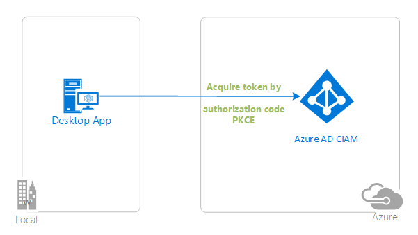
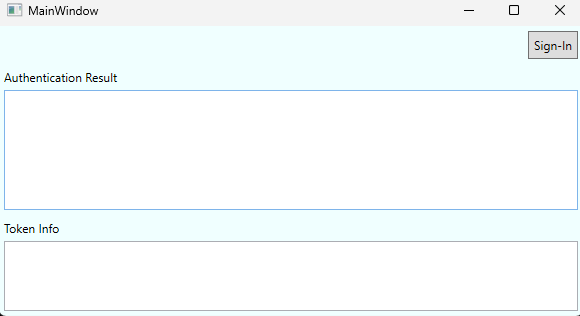
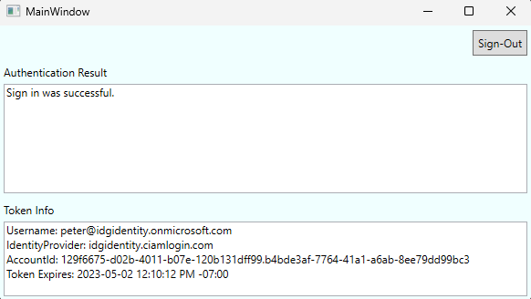

# A WPF application authenticating users against Azure AD for Customers using .NET Core

[](https://identitydivision.visualstudio.com/IDDP/_build/latest?definitionId=XXX)

* [Overview](#overview)
* [Scenario](#scenario)
* [Prerequisites](#prerequisites)
* [Setup the sample](#setup-the-sample)
* [Explore the sample](#explore-the-sample)
* [Troubleshooting](#troubleshooting)
* [About the code](#about-the-code)
* [Contributing](#contributing)
* [Learn More](#learn-more)

## Overview

This sample demonstrates a WPF .NET Core app that authenticates users against Azure AD.

## Scenario

1. The client WPF .NET Core app uses the  to sign-in a user and obtain a JWT [ID Token](https://aka.ms/id-tokens) from **Azure AD for Customers**.
1. The **ID Token** proves that the user has successfully authenticated against **Azure AD for Customers**.



## Prerequisites

* Either [Visual Studio](https://visualstudio.microsoft.com/downloads/) or [Visual Studio Code](https://code.visualstudio.com/download) and [.NET Core SDK](https://www.microsoft.com/net/learn/get-started)
* An external tenant. To create one, choose from the following methods:
    * (Recommended) Use the [Microsoft Entra External ID extension](https://aka.ms/ciamvscode/readme/marketplace) to set up an external tenant directly in Visual Studio Code.
    * [Create a new external tenant](https://learn.microsoft.com/entra/external-id/customers/how-to-create-external-tenant-portal) in the Microsoft Entra admin center.
* A user account in your **Microsoft Entra External ID** tenant.

## Setup the sample

### Step 1: Clone or download this repository

From your shell or command line:

```console
git clone https://github.com/Azure-Samples/ms-identity-ciam-dotnet-tutorial.git
```

or download and extract the repository *.zip* file.

> :warning: To avoid path length limitations on Windows, we recommend cloning into a directory near the root of your drive.

### Step 2: Navigate to project folder

```console
cd 1-Authentication\5-sign-in-dotnet-wpf
```

### Step 3: Register the sample application(s) in your tenant

There is one project in this sample. To register it, you can:

- follow the steps below for manually register your apps
- or use PowerShell scripts that:
  - **automatically** creates the Azure AD applications and related objects (passwords, permissions, dependencies) for you.
  - modify the projects' configuration files.

<details>
   <summary>Expand this section if you want to use this automation:</summary>

> :warning: If you have never used **Microsoft Graph PowerShell** before, we recommend you go through the [App Creation Scripts Guide](./AppCreationScripts/AppCreationScripts.md) once to ensure that your environment is prepared correctly for this step.

1. Ensure that you have PowerShell 7 or later which can be installed at [this link](https://learn.microsoft.com/powershell/scripting/install/installing-powershell-on-windows?view=powershell-7.3).
1. Run the script to create your Azure AD application and configure the code of the sample application accordingly.
1. For interactive process -in PowerShell, run:

    ```PowerShell
    cd .\AppCreationScripts\
    .\Configure.ps1 -TenantId "[Optional] - your tenant id" -AzureEnvironmentName "[Optional] - Azure environment, defaults to 'Global'"
    ```

> Other ways of running the scripts are described in [App Creation Scripts guide](./AppCreationScripts/AppCreationScripts.md). The scripts also provide a guide to automated application registration, configuration and removal which can help in your CI/CD scenarios.
</details>

#### Choose the Azure AD for Customers tenant where you want to create your applications

To manually register the apps, as a first step you'll need to:

1. Sign in to the [Azure portal](https://portal.azure.com).
1. If your account is present in more than one Azure AD for Customers tenant, select your profile at the top right corner in the menu on top of the page, and then **switch directory** to change your portal session to the desired Azure AD for Customers tenant.

#### Create User Flows

Please refer to: [Tutorial: Create user flow in Azure Active Directory CIAM](https://github.com/microsoft/entra-previews/blob/PP2/docs/3-Create-sign-up-and-sign-in-user-flow.md)

> :information_source: To enable password reset in Customer Identity Access Management (CIAM) in Azure Active Directory (Azure AD), please refer to: [Tutorial: Enable self-service password reset](https://github.com/microsoft/entra-previews/blob/PP2/docs/4-Enable-password-reset.md)

#### Add External Identity Providers

Please refer to:

* [Tutorial: Add Google as an identity provider](https://github.com/microsoft/entra-previews/blob/PP2/docs/6-Add-Google-identity-provider.md)
* [Tutorial: Add Facebook as an identity provider](https://github.com/microsoft/entra-previews/blob/PP2/docs/7-Add-Facebook-identity-provider.md)

#### Register the client app (ciam-wpf-sign-in)

1. Navigate to the [Azure portal](https://portal.azure.com) and select the **Azure AD for Customers** service.
1. Select the **App Registrations** blade on the left, then select **New registration**.
1. In the **Register an application page** that appears, enter your application's registration information:
    1. In the **Name** section, enter a meaningful application name that will be displayed to users of the app, for example `ciam-wpf-sign-in`.
    1. Under **Supported account types**, select **Accounts in this organizational directory only**
    1. Select **Register** to create the application.
1. In the **Overview** blade, find and note the **Application (client) ID**. You use this value in your app's configuration file(s) later in your code.
1. In the app's registration screen, select the **Authentication** blade to the left.
1. If you don't have a platform added, select **Add a platform** and select the **Public client (mobile & desktop)** option.
    1. In the **Redirect URIs** section, add **https://login.microsoftonline.com/common/oauth2/nativeclient**.
    1. Click **Save** to save your changes.
1. Since this app signs-in users, we will now proceed to select **delegated permissions**, which is is required by apps signing-in users.
    1. In the app's registration screen, select the **API permissions** blade in the left to open the page where we add access to the APIs that your application needs:
    1. Select the **Add a permission** button and then:
    1. Ensure that the **Microsoft APIs** tab is selected.
    1. In the *Commonly used Microsoft APIs* section, select **Microsoft Graph**
    1. In the **Delegated permissions** section, select **openid**, **offline_access** in the list. Use the search box if necessary.
    1. Select the **Add permissions** button at the bottom.
1. At this stage, the permissions are assigned correctly, but since it's a CIAM tenant, the users themselves cannot consent to these permissions. To get around this problem, we'd let the [tenant administrator consent on behalf of all users in the tenant](https://docs.microsoft.com/azure/active-directory/develop/v2-admin-consent). Select the **Grant admin consent for {tenant}** button, and then select **Yes** when you are asked if you want to grant consent for the requested permissions for all accounts in the tenant. You need to be a tenant admin to be able to carry out this operation.

##### Configure the client app (ciam-wpf-sign-in) to use your app registration

Open the project in your IDE (like Visual Studio or Visual Studio Code) to configure the code.

> In the steps below, "ClientID" is the same as "Application ID" or "AppId".

1. Open the `appsettings.json` file.
1. Find the placeholder `Enter_the_Tenant_Subdomain_Here` and replace it with the Directory (tenant) subdomain. For instance, if your tenant primary domain is *contoso.onmicrosoft.com*, use *contoso*.
1. Find the placeholder `Enter_the_Application_Id_Here` and replace the existing value with the application ID (clientId) of `ciam-wpf-sign-in` app copied from the Azure portal.

### Step 4: Running the sample

From your shell or command line, execute the following commands:

```console
    cd 1-Authentication\5-sign-in-dotnet-wpf
    dotnet run
```

## Explore the sample

* After you launch the sample you should see a window with a `Sign-In` button. Click the `Sign-In` button.
  


* After signing in you, the user should see a screen displaying that they have successfully signed-in and basic information about their account stored in the retrieved token.



## We'd love your feedback!

Were we successful in addressing your learning objective? Consider taking a moment to [share your experience with us](https://forms.microsoft.com/Pages/ResponsePage.aspx?id=v4j5cvGGr0GRqy180BHbR9p5WmglDttMunCjrD00y3NUM0FSM0U1RjdMWU1HVlZRNEZDRlhRTUs5UC4u).

## Troubleshooting

<details>
	<summary>Expand for troubleshooting info</summary>

ASP.NET core applications create session cookies that represent the identity of the caller. Some Safari users using iOS 12 had issues which are described in ASP.NET Core #4467 and the Web kit bugs database Bug 188165 - iOS 12 Safari breaks ASP.NET Core 2.1 OIDC authentication.

If your web site needs to be accessed from users using iOS 12, you probably want to disable the SameSite protection, but also ensure that state changes are protected with CSRF anti-forgery mechanism. See the how to fix section of Microsoft Security Advisory: iOS12 breaks social, WSFed and OIDC logins #4647

To provide feedback on or suggest features for Azure Active Directory, visit [User Voice page](https://feedback.azure.com/d365community/forum/79b1327d-d925-ec11-b6e6-000d3a4f06a4).
</details>

## About the code

The main configuration for the public client application is handled within the `App.xaml.cs` file. A `PublicClientApplication` is initialized along with a cache for storeing access tokens.

```Csharp
public static void CreateApplication()
        {
            var assembly = Assembly.GetExecutingAssembly();
            using var stream = assembly.GetManifestResourceStream("call_own_api_dotnet_wpf.appsettings.json");
            AppConfiguration = new ConfigurationBuilder()
               .AddJsonStream(stream)
               .Build();

            AzureAdConfig azureADConfig = AppConfiguration.GetSection("AzureAd").Get<AzureAdConfig>();

            var builder = PublicClientApplicationBuilder.Create(azureADConfig.ClientId)
                .WithAuthority(azureADConfig.Authority)
                .WithDefaultRedirectUri();

            _clientApp = builder.Build();
            TokenCacheHelper.EnableSerialization(_clientApp.UserTokenCache);
        }
```

You can see how the token cache is initialized in the `TokenCacheHelper.cs` file and can read more about token caching in Desktop applications [here](https://github.com/MicrosoftDocs/azure-docs/blob/main/articles/active-directory/develop/msal-net-token-cache-serialization.md#desktop-apps).

Within the `MainWindow.xaml.cs` file you'll see the main workflow for signing users in.

```Csharp
try
{
    authResult = await app.AcquireTokenSilent(scopes, firstAccount)
        .ExecuteAsync();
}
catch (MsalUiRequiredException ex)
{
    // A MsalUiRequiredException happened on AcquireTokenSilent. 
    // This indicates you need to call AcquireTokenInteractive to acquire a token
    System.Diagnostics.Debug.WriteLine($"MsalUiRequiredException: {ex.Message}");

    try
    {
        authResult = await app.AcquireTokenInteractive(scopes)
            .WithAccount(firstAccount)
            .WithParentActivityOrWindow(new WindowInteropHelper(this).Handle) // optional, used to center the browser on the window
            .WithPrompt(Prompt.SelectAccount)
            .ExecuteAsync();
    }
    catch (MsalException msalex)
    {
        ResultText.Text = $"Error Acquiring Token:{System.Environment.NewLine}{msalex}";
    }
}
catch (Exception ex)
{
    ResultText.Text = $"Error Acquiring Token Silently:{System.Environment.NewLine}{ex}";
    return;
}
```

First, what the application will attempt to do is see if there's a cached token that can be used to sign the user in. Failing this, the user will be prompted to provide credentials and sign-in.

Upon signing-out, the cache is cleared of all accounts and all corresponding access tokens.

```Csharp
private async void SignOutButton_Click(object sender, RoutedEventArgs e)
{
    var accounts = await App.PublicClientApp.GetAccountsAsync();
    if (accounts.Any())
    {
        try
        {
            await App.PublicClientApp.RemoveAsync(accounts.FirstOrDefault());
            this.ResultText.Text = "User has signed-out";
            this.TokenInfoText.Text = string.Empty;
            this.CallApiButton.Visibility = Visibility.Visible;
            this.SignOutButton.Visibility = Visibility.Collapsed;
        }
        catch (MsalException ex)
        {
            ResultText.Text = $"Error signing-out user: {ex.Message}";
        }
    }
}
```

</details>

## Contributing

If you'd like to contribute to this sample, see [CONTRIBUTING.MD](/CONTRIBUTING.md).

This project has adopted the [Microsoft Open Source Code of Conduct](https://opensource.microsoft.com/codeofconduct/). For more information, see the [Code of Conduct FAQ](https://opensource.microsoft.com/codeofconduct/faq/) or contact [opencode@microsoft.com](mailto:opencode@microsoft.com) with any additional questions or comments.

## Learn More

* [Customize the default branding](https://github.com/microsoft/entra-previews/blob/PP2/docs/5-Customize-default-branding.md)
* [OAuth 2.0 device authorization grant flow](https://github.com/microsoft/entra-previews/blob/PP2/docs/9-OAuth2-device-code.md)
* [Customize sign-in strings](https://github.com/microsoft/entra-previews/blob/PP2/docs/8-Customize-sign-in-strings.md)
* [Building Zero Trust ready apps](https://aka.ms/ztdevsession)
* [Microsoft.Identity.Web](https://aka.ms/microsoft-identity-web)
