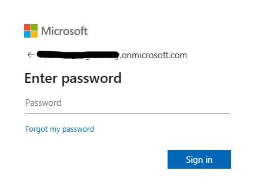
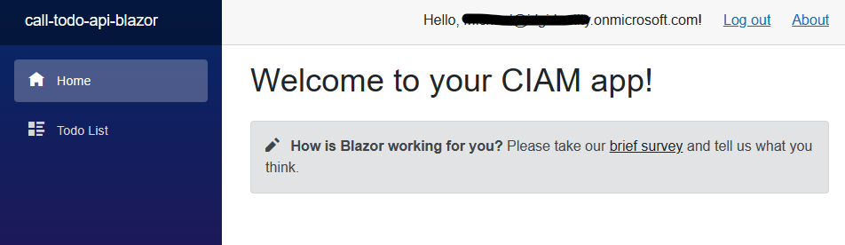
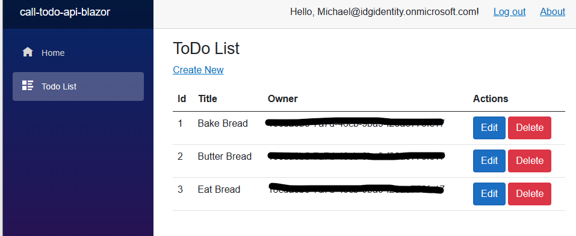

# How to secure a Blazor Server app with the Microsoft identity platform on CIAM

[](https://identitydivision.visualstudio.com/IDDP/_build/latest?definitionId=XXX)

* [Overview](#overview)
* [Scenario](#scenario)
* [Prerequisites](#prerequisites)
* [Setup the sample](#setup-the-sample)
* [Explore the sample](#explore-the-sample)
* [Troubleshooting](#troubleshooting)
* [About the code](#about-the-code)
* [How to deploy this sample to Azure](#how-to-deploy-this-sample-to-azure)
* [Contributing](#contributing)
* [Learn More](#learn-more)

## Overview

This sample demonstrates an ASP.NET Core Web App signing-in a user and calling an ASP.NET Core Web API that is secured with Azure AD CIAM.

## Scenario

1. The client Blazor Server App uses the [Microsoft.Identity.Web](https://aka.ms/microsoft-identity-web) to sign-in a user and obtain a JWT [ID Token](https://aka.ms/id-tokens) and an [Access Token](https://aka.ms/access-tokens) from **Azure AD CIAM**.
1. The **access token** is used as a *bearer* token to authorize the user to call the .NET Core Web API protected by **Azure AD CIAM**.
1. The service uses the [Microsoft.Identity.Web](https://aka.ms/microsoft-identity-web) to protect the Web api, check permissions and validate tokens.


## Prerequisites

* An **Azure AD CIAM** tenant. For more information, see: [How to get an Azure AD CIAM tenant](https://github.com/microsoft/entra-previews/blob/PP2/docs/1-Create-a-CIAM-tenant.md)
* A user account in your **Azure AD CIAM** tenant.

>This sample will not work with a **personal Microsoft account**. If you're signed in to the [Azure portal](https://portal.azure.com) with a personal Microsoft account and have not created a user account in your directory before, you will need to create one before proceeding.

## Setup the sample

### Step 1: Clone or download this repository

From your shell or command line:

```console
git clone https://github.com/Azure-Samples/ms-identity-ciam-dotnet-tutorial.git
```

or download and extract the repository *.zip* file.

> :warning: To avoid path length limitations on Windows, we recommend cloning into a directory near the root of your drive.


### Step 3: Register the sample application(s) in your tenant

There are two projects in this sample. Each needs to be separately registered in your Azure AD tenant. To register these projects, you can:

- follow the steps below for manually register your apps
- or use PowerShell scripts that:
  - **automatically** creates the Azure AD applications and related objects (passwords, permissions, dependencies) for you.
  - modify the projects' configuration files.

<details>
   <summary>Expand this section if you want to use this automation:</summary>

> :warning: If you have never used **Microsoft Graph PowerShell** before, we recommend you go through the [App Creation Scripts Guide](./AppCreationScripts/AppCreationScripts.md) once to ensure that your environment is prepared correctly for this step.
  
1. On Windows, run PowerShell as **Administrator** and navigate to the root of the cloned directory
1. In PowerShell run:

    ```PowerShell
    Set-ExecutionPolicy -ExecutionPolicy RemoteSigned -Scope Process -Force
    ```

1. Run the script to create your Azure AD application and configure the code of the sample application accordingly.
1. For interactive process -in PowerShell, run:

    ```PowerShell
    cd .\AppCreationScripts\
    .\Configure.ps1 -TenantId "[Optional] - your tenant id" -AzureEnvironmentName "[Optional] - Azure environment, defaults to 'Global'"
    ```

> Other ways of running the scripts are described in [App Creation Scripts guide](./AppCreationScripts/AppCreationScripts.md). The scripts also provide a guide to automated application registration, configuration and removal which can help in your CI/CD scenarios.
    
> :information_source: This sample can make use of client certificates. You can use **AppCreationScripts** to register an Azure AD application with certificates. See: [How to use certificates instead of client secrets](./README-use-certificate.md)

</details>

#### Choose the Azure AD CIAM tenant where you want to create your applications

To manually register the apps, as a first step you'll need to:

1. Sign in to the [Azure portal](https://portal.azure.com).
1. If your account is present in more than one Azure AD CIAM tenant, select your profile at the top right corner in the menu on top of the page, and then **switch directory** to change your portal session to the desired Azure AD CIAM tenant.

#### Create User Flows

Please refer to: [Tutorial: Create user flow in Azure Active Directory CIAM](https://github.com/microsoft/entra-previews/blob/PP2/docs/3-Create-sign-up-and-sign-in-user-flow.md)

> :information_source: To enable password reset in Customer Identity Access Management (CIAM) in Azure Active Directory (Azure AD), please refer to: [Tutorial: Enable self-service password reset](https://github.com/microsoft/entra-previews/blob/PP2/docs/4-Enable-password-reset.md)

#### Add External Identity Providers

Please refer to:

* [Tutorial: Add Google as an identity provider](https://github.com/microsoft/entra-previews/blob/PP2/docs/6-Add-Google-identity-provider.md)
* [Tutorial: Add Facebook as an identity provider](https://github.com/microsoft/entra-previews/blob/PP2/docs/7-Add-Facebook-identity-provider.md)

#### Register the service app (TodoListApi)

1. Navigate to the [Azure portal](https://portal.azure.com) and select the **Azure AD CIAM** service.
1. Select the **App Registrations** blade on the left, then select **New registration**.
1. In the **Register an application page** that appears, enter your application's registration information:
    1. In the **Name** section, enter a meaningful application name that will be displayed to users of the app, for example `TodoListApi`.
    1. Under **Supported account types**, select **Accounts in this organizational directory only**
    1. Select **Register** to create the application.
1. In the **Overview** blade, find and note the **Application (client) ID**. You use this value in your app's configuration file(s) later in your code.
1. In the app's registration screen, select the **Authentication** blade to the left.
1. If you don't have a platform added, select **Add a platform** and select the **Web** option.
    1. In the **Redirect URI** section enter the following redirect URI:
        1. `https://localhost:44321/signin-oidc`
    1. Click **Save** to save your changes.
1. In the app's registration screen, select the **Expose an API** blade to the left to open the page where you can publish the permission as an API for which client applications can obtain [access tokens](https://aka.ms/access-tokens) for. The first thing that we need to do is to declare the unique [resource](https://docs.microsoft.com/azure/active-directory/develop/v2-oauth2-auth-code-flow) URI that the clients will be using to obtain access tokens for this API. To declare an resource URI(Application ID URI), follow the following steps:
    1. Select **Set** next to the **Application ID URI** to generate a URI that is unique for this app.
    1. For this sample, accept the proposed Application ID URI (`https://{tenantName}.onmicrosoft.com/{clientId}`) by selecting **Save**.
        > :information_source: Read more about Application ID URI at [Validation differences by supported account types (signInAudience)](https://docs.microsoft.com/azure/active-directory/develop/supported-accounts-validation).
    
##### Publish Delegated Permissions

1. All APIs must publish a minimum of one [scope](https://docs.microsoft.com/azure/active-directory/develop/v2-oauth2-auth-code-flow#request-an-authorization-code), also called [Delegated Permission](https://docs.microsoft.com/azure/active-directory/develop/v2-permissions-and-consent#permission-types), for the client apps to obtain an access token for a *user* successfully. To publish a scope, follow these steps:
1. Select **Add a scope** button open the **Add a scope** screen and Enter the values as indicated below:
    1. For **Scope name**, use `ToDoList.Read`.
    1. For **Admin consent display name** type in *Read users ToDo list using the 'TodoListApi'*.
    1. For **Admin consent description** type in *Allow the app to read the user's ToDo list using the 'TodoListApi'*.
    1. Keep **State** as **Enabled**.
    1. Select the **Add scope** button on the bottom to save this scope.
    > Repeat the steps above for another scope named **ToDoList.ReadWrite**
1. Select the **Manifest** blade on the left.
    1. Set `accessTokenAcceptedVersion` property to **2**.
    1. Select on **Save**.

> :information_source:  Follow [the principle of least privilege when publishing permissions](https://learn.microsoft.com/security/zero-trust/develop/protected-api-example) for a web API.

##### Publish Application Permissions

1. All APIs should publish a minimum of one [App role for applications](https://docs.microsoft.com/azure/active-directory/develop/howto-add-app-roles-in-azure-ad-apps#assign-app-roles-to-applications), also called [Application Permission](https://docs.microsoft.com/azure/active-directory/develop/v2-permissions-and-consent#permission-types), for the client apps to obtain an access token as *themselves*, i.e. when they are not signing-in a user. **Application permissions** are the type of permissions that APIs should publish when they want to enable client applications to successfully authenticate as themselves and not need to sign-in users. To publish an application permission, follow these steps:
1. Still on the same app registration, select the **App roles** blade to the left.
1. Select **Create app role**:
    1. For **Display name**, enter a suitable name for your application permission, for instance **ToDoList.Read.All**.
    1. For **Allowed member types**, choose **Application** to ensure other applications can be granted this permission.
    1. For **Value**, enter **ToDoList.Read.All**.
    1. For **Description**, enter *Allow the app to read every user's ToDo list using the 'TodoListApi'*.
    1. Select **Apply** to save your changes.
    > Repeat the steps above for another app permission named **ToDoList.ReadWrite.All**

##### Configure Optional Claims

1. Still on the same app registration, select the **Token configuration** blade to the left.
1. Select **Add optional claim**:
    1. Select **optional claim type**, then choose **Access**.
    1. Select the optional claim **idtyp**.
    > Indicates token type. This claim is the most accurate way for an API to determine if a token is an app token or an app+user token. This is not issued in tokens issued to users.
    1. Select **Add** to save your changes.

##### Configure the service app (TodoListApi) to use your app registration

Open the project in your IDE (like Visual Studio or Visual Studio Code) to configure the code.

> In the steps below, "ClientID" is the same as "Application ID" or "AppId".

1. Open the `TodoListApi\appsettings.json` file.
1. Find the key `TenantId` and replace the existing value with your Azure AD tenant/directory ID.
1. Find the key `ClientId` and replace the existing value with the application ID (clientId) of `TodoListApi` app copied from the Azure portal.

#### Register the client app (call-todo-api-blazor)

1. Navigate to the [Azure portal](https://portal.azure.com) and select the **Azure AD CIAM** service.
1. Select the **App Registrations** blade on the left, then select **New registration**.
1. In the **Register an application page** that appears, enter your application's registration information:
    1. In the **Name** section, enter a meaningful application name that will be displayed to users of the app, for example `call-todo-api-blazor`.
    1. Under **Supported account types**, select **Accounts in this organizational directory only**
    1. Select **Register** to create the application.
1. In the **Overview** blade, find and note the **Application (client) ID**. You use this value in your app's configuration file(s) later in your code.
1. In the app's registration screen, select the **Authentication** blade to the left.
1. If you don't have a platform added, select **Add a platform** and select the **Web** option.
    1. In the **Redirect URI** section enter the following redirect URI:
        1. `https://localhost:44321/signin-oidc`
    1. In the **Front-channel logout URL** section, set it to `https://localhost:44321/signout-oidc`.
    1. Click **Save** to save your changes.
1. In the app's registration screen, select the **Certificates & secrets** blade in the left to open the page where you can generate secrets and upload certificates.
1. In the **Client secrets** section, select **New client secret**:
    1. Type a key description (for instance `app secret`).
    1. Select one of the available key durations (**6 months**, **12 months** or **Custom**) as per your security posture.
    1. The generated key value will be displayed when you select the **Add** button. Copy and save the generated value for use in later steps.
    1. You'll need this key later in your code's configuration files. This key value will not be displayed again, and is not retrievable by any other means, so make sure to note it from the Azure portal before navigating to any other screen or blade.
    > :warning: For enhanced security, consider using **certificates** instead of client secrets. See: [How to use certificates instead of secrets](./README-use-certificate.md).
1. Since this app signs-in users, we will now proceed to select **delegated permissions**, which is is required by apps signing-in users.
    1. In the app's registration screen, select the **API permissions** blade in the left to open the page where we add access to the APIs that your application needs:
    1. Select the **Add a permission** button and then:
    1. Ensure that the **My APIs** tab is selected.
    1. In the list of APIs, select the API `TodoListApi`.
    1. In the **Delegated permissions** section, select **ToDoList.Read**, **ToDoList.ReadWrite** in the list. Use the search box if necessary.
    1. Select the **Add permissions** button at the bottom.
1. At this stage, the permissions are assigned correctly, but since it's a CIAM tenant, the users themselves cannot consent to these permissions. To get around this problem, we'd let the [tenant administrator consent on behalf of all users in the tenant](https://docs.microsoft.com/azure/active-directory/develop/v2-admin-consent). Select the **Grant admin consent for {tenant}** button, and then select **Yes** when you are asked if you want to grant consent for the requested permissions for all accounts in the tenant. You need to be a tenant admin to be able to carry out this operation.

##### Configure the client app (call-todo-api-blazor) to use your app registration

Open the project in your IDE (like Visual Studio or Visual Studio Code) to configure the code.

> In the steps below, "ClientID" is the same as "Application ID" or "AppId".

1. Open the `ToDoListClient\appsettings.json` file.
1. Find the key `TenantId` and replace the existing value with your Azure AD tenant/directory ID.
1. Find the key `ClientId` and replace the existing value with the application ID (clientId) of `call-todo-api-blazor` app copied from the Azure portal.
1. Find the key `ClientSecret` and replace the existing value with the generated secret that you saved during the creation of `call-todo-api-blazor` copied from the Azure portal.
1. Find the key `Scopes` and insert the following values in the array: **"api://<your_service_api_client_id>/ToDoList.Read"** and **"api://<your_service_api_client_id>/ToDoList.ReadWrite"**.
1. Find the key `BaseAddress` and replace the existing value with the base address of `TodoListApi` (by default `https://localhost:44351`).

### Step 4: Running the sample

From your shell or command line, execute the following commands:

```console
    cd 2-Authorization\2-call-own-api-blazor-server\TodoListApi
    dotnet run
```

Then, open a separate command terminal and run:

```console
    cd 2-Authorization\2-call-own-api-blazor-server\ToDoListClient
    dotnet run
```

## Explore the sample

After starting the application, go to the url `https://localhost:44321` in any web browse. If you haven't signed in to a CIAM account already you will be prompted with a sign-in screen similar to what is shown below.



After successfully signing in, you should see the home screen with a greeting label at the top and a navigation bar to the side.



You can click on the `Todo list` button in the side navigation bar to see a todo list that interacts with your Azure AD CIAM protected API.



Each of the todo's displayed show a simple message along with an [object id](https://learn.microsoft.com/en-us/partner-center/find-ids-and-domain-names#find-the-user-object-id) for the user who posted the to-do. From the to-do list screen you'll be able to read, create, update and delete individual to-do's.

To sign-out of the application click the **Log out** button in the upper right corner of the screen.

## We'd love your feedback!

Were we successful in addressing your learning objective? Consider taking a moment to [share your experience with us](https://forms.microsoft.com/Pages/ResponsePage.aspx?id=v4j5cvGGr0GRqy180BHbR9p5WmglDttMunCjrD00y3NUOE1ZQjlJR0M2NDQ0SUFHSExLNTBLTzlFTC4u).


## Troubleshooting

<details>
	<summary>Expand for troubleshooting info</summary>


To provide feedback on or suggest features for Azure Active Directory, visit [User Voice page](https://feedback.azure.com/d365community/forum/79b1327d-d925-ec11-b6e6-000d3a4f06a4).
</details>

## About the code

The setup for the main Blazor application happens in the `Program.cs` file. An application is created and configured based on the settings found within the `appsettings.json` file including information such as the application's tenant id and the id for the application registered in **Azure AD CIAM**.

```Csharp
builder.Services.AddAuthentication(OpenIdConnectDefaults.AuthenticationScheme)
    .AddMicrosoftIdentityWebApp(builder.Configuration)
    .EnableTokenAcquisitionToCallDownstreamApi()
    .AddDownstreamApi("ToDoApi", builder.Configuration.GetSection("ToDoApi"))
    .AddInMemoryTokenCaches();
```

Note that this sample uses the `Microsoft.Identity.Web.DownstreamApi` library to simplify making authenticated HTTP calls to your API and is already configured to cache access tokens for your requests. This will be discussed further down this section.

The login controllers and navigation are configured for you automatically with the `Microsoft.Identity.Web.UI` library.

```Csharp
builder.Services.AddControllersWithViews()
        .AddMicrosoftIdentityUI();
```

The part of the application responsible for calling the todo API is found within the `ToDoListClient\Pages\ToDoPages` directory of the project.

The `ToDoList.razor` file is responsible for displaying all todo's stored in the **ToDoListAPI** by using to-do's retrieved by the `ToDoListBase.cs` file. It will only show to-do's affiliated with the logged-in user and fetches these to-do's using an injected `IDownstreamApi` interface. With the `IDownstreamApi` all request authentication is handled for you with respect to acquiring and providing access tokens with requests. It's also already configured to use tokens stored within the application's cache.

```Csharp
// ToDoListBase.cs

/// <summary>
/// Gets all todo list items.
/// </summary>
/// <returns></returns>
private async Task GetToDoListService()
{
    try
    {
        toDoList = (await DownstreamApi.GetForUserAsync<IEnumerable<ToDo>>(
            ServiceName,
            options => options.RelativePath = "/api/todolist"))!;
    }
    catch (Exception ex)
    {
        Console.WriteLine(ex.Message);

        // Process the exception from a user challenge
        ConsentHandler.HandleException(ex);
    }
}
```

```Razor
<!-- Fetch the values stored in the 'toDoList' variable and display them to the user -->
<tbody>
    @foreach (var item in toDoList)
    {
        <tr>
            <td>
                @item.Id
            </td>
            <td>
                @item.Description
            </td>
            <td>
                @item.Owner
            </td>
            <td>
                <a class="btn btn-primary" href="/edit/@item.Id">Edit</a>
                <button class="btn btn-danger" @onclick="@(() => DeleteItem(item.Id))">Delete</button>
            </td>
        </tr>
    }
</tbody>
```

The other files also leverage the `IDownstreamAPI` to make basic **POST**, **PATCH**, **PUT** and **DELETE** requests with the needed authentication as mentioned before. They are also configured to handle serialization for you to translate JSON responses into C# objects and vice versa.

A good example can be found in the `ToDoListClient\Pages\ToDoPages\Edit.razor` file. After a user finishes editing a todo and submits their edit they'll trigger the `EditTask` method which takes in the C# `ToDo` object, converts it to JSON and sends it to the API. The method also returns a deserialized `ToDo` object from the JSON response from the API even though it is not used directly here.

```CSharp
protected async Task EditTask()
{
    await _downstreamApi.PutForUserAsync<ToDo, ToDo>(
        ServiceName,
        toDo,
        options => options.RelativePath = $"api/todolist/{Id}");

    Navigation.NavigateTo("todolist");
}
```

## How to deploy this sample to Azure

<details>
<summary>Expand the section</summary>

### Deploying web API to Azure App Services

There is one web API in this sample. To deploy it to **Azure App Services**, you'll need to:

* create an **Azure App Service**
* publish the projects to the **App Services**

> :warning: Please make sure that you have not switched on the *[Automatic authentication provided by App Service](https://docs.microsoft.com/azure/app-service/scenario-secure-app-authentication-app-service)*. It interferes the authentication code used in this code example.


### Deploying Web app to Azure App Service

There is one web app in this sample. To deploy it to **Azure App Services**, you'll need to:

- create an **Azure App Service**
- publish the projects to the **App Services**, and
- update its client(s) to call the website instead of the local environment.
#### Update the CIAM app registration (call-todo-api-blazor)

1. Navigate back to to the [Azure portal](https://portal.azure.com).
In the left-hand navigation pane, select the **Azure Active Directory** service, and then select **App registrations (Preview)**.
1. In the resulting screen, select the `call-todo-api-blazor` application.
1. In the app's registration screen, select **Authentication** in the menu.
    1. In the **Redirect URIs** section, update the reply URLs to match the site URL of your Azure deployment. For example:
        1. `https://call-todo-api-blazor.azurewebsites.net/signin-oidc`
    1. Update the **Front-channel logout URL** fields with the address of your service, for example [https://call-todo-api-blazor.azurewebsites.net](https://call-todo-api-blazor.azurewebsites.net)

#### Update authentication configuration parameters (call-todo-api-blazor)

1. In your IDE, locate the `call-todo-api-blazor` project. Then, open `ToDoListClient\appsettings.json`.
2. Find the key for **redirect URI** and replace its value with the address of the web app you published, for example, [https://call-todo-api-blazor.azurewebsites.net/redirect](https://call-todo-api-blazor.azurewebsites.net/redirect).
3. Find the key for **web API endpoint** and replace its value with the address of the web API you published, for example, [https://TodoListApi.azurewebsites.net/api](https://TodoListApi.azurewebsites.net/api).

> :warning: If your app is using an *in-memory* storage, **Azure App Services** will spin down your web site if it is inactive, and any records that your app was keeping will be empty. In addition, if you increase the instance count of your website, requests will be distributed among the instances. Your app's records, therefore, will not be the same on each instance.
</details>

## Contributing

If you'd like to contribute to this sample, see [CONTRIBUTING.MD](/CONTRIBUTING.md).

This project has adopted the [Microsoft Open Source Code of Conduct](https://opensource.microsoft.com/codeofconduct/). For more information, see the [Code of Conduct FAQ](https://opensource.microsoft.com/codeofconduct/faq/) or contact [opencode@microsoft.com](mailto:opencode@microsoft.com) with any additional questions or comments.

## Learn More

* [Customize the default branding](https://github.com/microsoft/entra-previews/blob/PP2/docs/5-Customize-default-branding.md)
* [OAuth 2.0 device authorization grant flow](https://github.com/microsoft/entra-previews/blob/PP2/docs/9-OAuth2-device-code.md)
* [Customize sign-in strings](https://github.com/microsoft/entra-previews/blob/PP2/docs/8-Customize-sign-in-strings.md)
* [Building Zero Trust ready apps](https://aka.ms/ztdevsession)
* [Validating Access Tokens](https://docs.microsoft.com/azure/active-directory/develop/access-tokens#validating-tokens)
* [User and application tokens](https://docs.microsoft.com/azure/active-directory/develop/access-tokens#user-and-application-tokens)
* [Validation differences by supported account types](https://docs.microsoft.com/azure/active-directory/develop/supported-accounts-validation)
* [How to manually validate a JWT access token using the Microsoft identity platform](https://github.com/Azure-Samples/active-directory-dotnet-webapi-manual-jwt-validation/blob/master/README.md)
