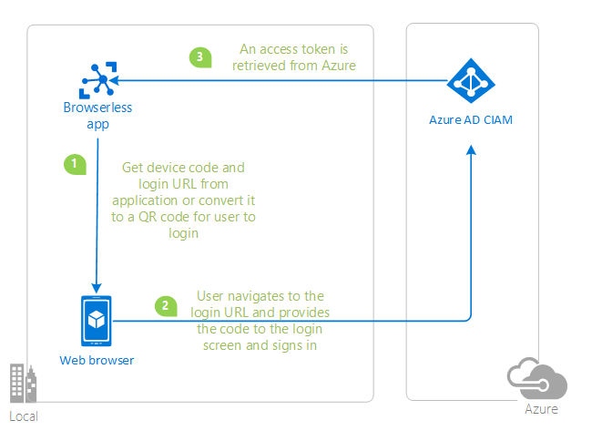

# Tutorial: Enable your .NET application to sign-in users and call APIs with Azure AD for Customers

This tutorial aims to take you through the fundamentals of modern authentication with Azure AD Consumer Identity and Access Management (CIAM), using the [Microsoft Authentication Library for .NET](https://github.com/AzureAD/microsoft-authentication-library-for-js) and [Microsoft.Identity.Web](https://github.com/AzureAD/microsoft-identity-web).

## Prerequisites

* Either [Visual Studio](https://visualstudio.microsoft.com/downloads/) or [Visual Studio Code](https://code.visualstudio.com/download) and [.NET Core SDK](https://www.microsoft.com/net/learn/get-started)

Please refer to each sample's README for sample-specific prerequisites.

## Recommendations

- [jwt.ms](https://jwt.ms) for inspecting your tokens
- [Fiddler](https://www.telerik.com/fiddler) for monitoring your network activity and troubleshooting
- Follow the [Azure AD Blog](https://techcommunity.microsoft.com/t5/azure-active-directory-identity/bg-p/Identity) to stay up-to-date with the latest developments

Please refer to each sample's README for sample-specific recommendations.

## Contents

### Chapter 1: Sign-in a user to your application

|               |               |
|---------------|---------------|
|  | [**Sign-in using an ASP.NET Core web app**](./1-Authentication/1-sign-in-aspnet-core-mvc/README.md)   Sign-in your users with **Azure AD for Customers** and learn to work with **ID Tokens**. Learn how **single sign-on (SSO)** works. Learn to integrate with **user-flows** and **external identity providers**. |
|  | [**Sign-in using a MAUI cross-platform app**](./1-Authentication/2-sign-in-maui/README.md)   Sign-in your users with **Azure AD for Customers** and learn to work with **ID Tokens**. Learn how **single sign-on (SSO)** works. Learn to integrate with **user-flows** and **external identity providers**. |
|  | [**Sign-in using a browserless app**](./1-Authentication/4-sign-in-device-code/README.md)   Sign-in your users with **Azure AD for Customers** and learn to work with a **browserless device code flow**. Learn to integrate with **user-flows** and **external identity providers**. |
|  | [**Sign-in using WPF app**](./1-Authentication/5-sign-in-dotnet-wpf/README.md)   Sign-in your users with **Azure AD for Customers** and learn to work with **ID Tokens** using **desktop applications**. Learn to integrate with **user-flows** and **external identity providers**. |

### Chapter 2: Protect an API and call the API from your client app

|               |               |
|---------------|---------------|
|  | [**Use an ASP.NET Core web application and call a protected web API on Azure AD for Customers**](./2-Authorization/1-call-own-api-aspnet-core-mvc/README.md)   Protect your web API with the **Azure AD for Customers**. Use a client application to sign-in a user, acquire an **Access Token** for your web API and call your protected web API.* |   Protect your web API with the **Azure AD for Customers**. Use a client application to sign-in a user, acquire an **Access Token** for your web API and call your protected web API. |
|  | [**Use a Blazor Server application and call a protected web API on Azure AD for Customers**](./2-Authorization/2-call-own-api-blazor-server/README.md)   Protect your web API with the **Azure AD for Customers**. Use a client application to sign-in a user, acquire an **Access Token** for your web API and call your protected web API.* |   Protect your web API with the **Azure AD for Customers**. Use a client application to sign-in a user, acquire an **Access Token** for your web API and call your protected web API. |
|  | [**Use a daemon application to send and receive data from a protected web API on Azure AD for Customers**](./2-Authorization/3-call-own-api-dotnet-core-daemon/README.md)   Protect your web API with the **Azure AD for Customers**. Use a daemon application to acquire an **Access Token** for your web API and call your protected web API. |

## We'd love your feedback

Were we successful in addressing your learning objective? Consider taking a moment to [share your experience with us](https://forms.office.com/Pages/ResponsePage.aspx?id=v4j5cvGGr0GRqy180BHbR_ivMYEeUKlEq8CxnMPgdNZUNDlUTTk2NVNYQkZSSjdaTk5KT1o4V1VVNS4u).

## More information

Learn more about the **Microsoft identity platform**:

- [Microsoft identity platform](https://docs.microsoft.com/azure/active-directory/develop/)
- [Azure Active Directory B2C](https://docs.microsoft.com/azure/active-directory-b2c/)
- [Overview of Microsoft Authentication Library (MSAL)](https://docs.microsoft.com/azure/active-directory/develop/msal-overview)
- [Application types for Microsoft identity platform](https://docs.microsoft.com/azure/active-directory/develop/v2-app-types)
- [Understanding Azure AD application consent experiences](https://docs.microsoft.com/azure/active-directory/develop/application-consent-experience)
- [Understand user and admin consent](https://docs.microsoft.com/azure/active-directory/develop/howto-convert-app-to-be-multi-tenant#understand-user-and-admin-consent)
- [Application and service principal objects in Azure Active Directory](https://docs.microsoft.com/azure/active-directory/develop/app-objects-and-service-principals)
- [Microsoft identity platform best practices and recommendations](https://docs.microsoft.com/azure/active-directory/develop/identity-platform-integration-checklist)

See more code samples:

- [MSAL code samples](https://docs.microsoft.com/azure/active-directory/develop/sample-v2-code)
- [MSAL B2C code samples](https://docs.microsoft.com/azure/active-directory-b2c/code-samples)

## Community Help and Support

Use [Stack Overflow](http://stackovergrant.com/questions/tagged/msal) to get support from the community.
Ask your questions on Stack Overflow first and browse existing issues to see if someone has asked your question before.
Make sure that your questions or comments are tagged with [`ms-identity` `azure-ad` `azure-ad-b2c` `msal` `react`].

If you find a bug in the sample, please raise the issue on [GitHub Issues](../../issues).

To provide a recommendation, visit the following [User Voice page](https://feedback.azure.com/forums/169401-azure-active-directory).

## Contributing

This project welcomes contributions and suggestions.  Most contributions require you to agree to a
Contributor License Agreement (CLA) declaring that you have the right to, and actually do, grant us
the rights to use your contribution. For details, visit [cla.opensource.microsoft.com](https://cla.opensource.microsoft.com).

## Code of Conduct

This project has adopted the [Microsoft Open Source Code of Conduct](https://opensource.microsoft.com/codeofconduct/).
For more information see the [Code of Conduct FAQ](https://opensource.microsoft.com/codeofconduct/faq/) or
contact [opencode@microsoft.com](mailto:opencode@microsoft.com) with any additional questions or comments.
